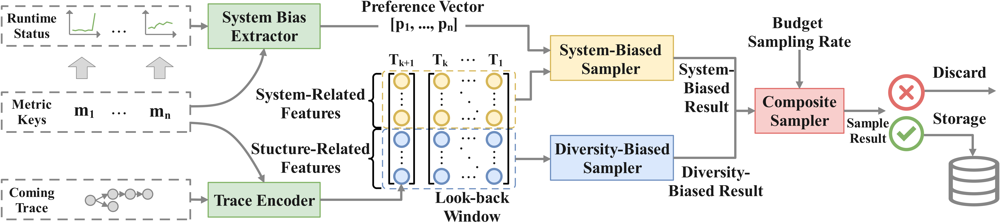

# TraStrainer

This repository is the basic implementation of `TraStrainer`, an adaptive sampler for distributed traces with system runtime state.

## Description
We introduce TraStrainer, an online sampler that takes into account both system runtime state and trace diversity. TraStrainer employs an interpretable and automated encoding method to represent traces as vectors. Simultaneously, it adaptively determines sampling preferences by analyzing system runtime metrics. When sampling, it combines the results of system-bias and diversity-bias through a dynamic voting mechanism.



## How to run it
### Environment Requirements
- python >=3.9
- numpy==1.23.2
- pandas==1.4.3
- scikit-learn==1.3.0
- torch==1.9.0
- treelib==1.7.0

Python package requirements can be installed by `pip install -r requirements.txt`

### Run demo
Run TraStrainer sampler:
```
python sampler.py --path './data/test' --rate 0.1
```

Explanations of parameters:
```                
usage: sampler.py [-h] [--path PATH] [--rate RATE]

options:
  -h, --help   show this help message and exit
  --path PATH  set up data dir path
  --rate RATE  set up sample rate
```

Example output of sampling results for each trace:
```
TraceID:05cc4fae5e0527cdcc7a5c5182d5ca08         SystemRate:0.30/0.84    DiversityRate:1.00/0.86         IsAnd:0    Sample:True     CurSampleRate:0.10
TraceID:012d68b1bfee876cb5591148d80989cb         SystemRate:0.99/0.54    DiversityRate:0.60/0.25         IsAnd:0    Sample:True     CurSampleRate:0.18
TraceID:0163a3c609fab47d57e071bc12344f25         SystemRate:0.67/0.64    DiversityRate:0.33/0.97         IsAnd:1    Sample:False    CurSampleRate:0.17
TraceID:090074518bc6053f57e5bc4028143a3c         SystemRate:0.55/0.47    DiversityRate:0.31/0.06         IsAnd:1    Sample:True     CurSampleRate:0.23
TraceID:034df2a0adfbcca9c78e23b918e5dd34         SystemRate:0.48/0.27    DiversityRate:0.18/0.48         IsAnd:1    Sample:False    CurSampleRate:0.21
```

Example output of overall sampling results:
```
sampling_rate:0.1, sampling trace_ids:['05cc4fae5e0527cdcc7a5c5182d5ca08', '012d68b1bfee876cb5591148d80989cb', '090074518bc6053f57e5bc4028143a3c', '13bb3c4f57977040aa5003745bdce99b', '0caefeb9413afdb7e418c6967ed77a0a', '165c0244a8964da3fd3e6c1d752201f8', '18ff5ebad180a00f3b93fee41d386d5d', '1ae4cac2fa9dbcb5855eebf8899dbdf7', '17cee80d03a9a0989dd0f9d2d1435f02', '18a10608dd8b24920218187cae23b916', '24bcb0fde1c9f6d7a4659c4f81bcc043', '223cf56b18e097d9373c4e81f4c39676', '1fcaa375be401c00ae4fd118666557aa', '1e0232eb9f379516a7e91be84c967536', '27993fc39e672f2622edb87f223842cf', '41341d9620015f017308d6cffa2de52e', '439dfd44eee14b4c54dfc03feab5d696', '49ce767f23644c296c897ef488915325', '4ae5802371d2189f2dbed084a02c8377', '543429a06ad3b9b197c5ae7c88324ae4', '55e1510d53f1518fe169cf567a98590b', '64aca34ccc08803ea34ac5d012918bba', '6380912a18ad31c881a61023462cdf4e', '6b88f96085fb5f5b09a26728fc683ed3', '6a5201248e37ee4ee57b4728689a48c6', '70f4b8913a5073f9111c418546cd1422', '6e477692e61a2027741d66af474ef42e', '7358fcbd3783db39830f947dd850bc1e', '8331196379617826b9153f15f03da0eb', '7fe3f176548de9128e25ea327ca0f68e', '803784ee48217efebe60f4d2a93fc157', '890c9938f6eb7d905da437c8724758d1', '883602be5553b8b51e62894360710da6', '87edc218fcaa23cca842860ebccc711c', '88cd7284f1f73a9523c1beb2c85094a6']
```

## Dataset
We release Dataset $\mathcal{B}$ based on two open-source microservice benchmarks, `TrainTicket` and `Hipster(OnlineBoutique)`. We also provide a demo input for testing purposes. Dataset $\mathcal{A}$ involves proprietary production data from company $\mathcal{H}$, which is currently not publicly available. However, we plan to release the data after applying anonymization techniques to protect sensitive information.

[data/dataset/hipster/batches/](./data/dataset/hipster/batches/) is the dataset of OnlineBoutique

[data/dataset/train_ticket/test/](./data/dataset/train_ticket/test/) is the dataset of Trainticket

[label.json](./data/dataset/train_ticket/test/label.json) is the label of root causes in datasets

As an example,

```
    {
        "inject_time": "2023-01-30 11:51:46",
        "inject_timestamp": "1675079506",
        "inject_pod": "ts-contacts-service-866bd68c97-dzqgd",
        "inject_type": "network_delay"
    },
```

`inject_pod` and `inject_timestamp` means where and when the root cause was injected, `inject_type` shows the type of the fault. 

## Directory Structure
```
TraStrainer
├── data # demo input & datasets
├── checkpoints # model checkpoints
├── LTSF_Linear # the LTSF model for system bias extractor
├── entry.py # entry point
├── metric_learner.py # train the LTSF model
├── metric_process.py # preprocess the metrics
├── README.md
├── requirements.txt # python requirements
└── TraStrainer.py # main logic of TraStrainer
```
